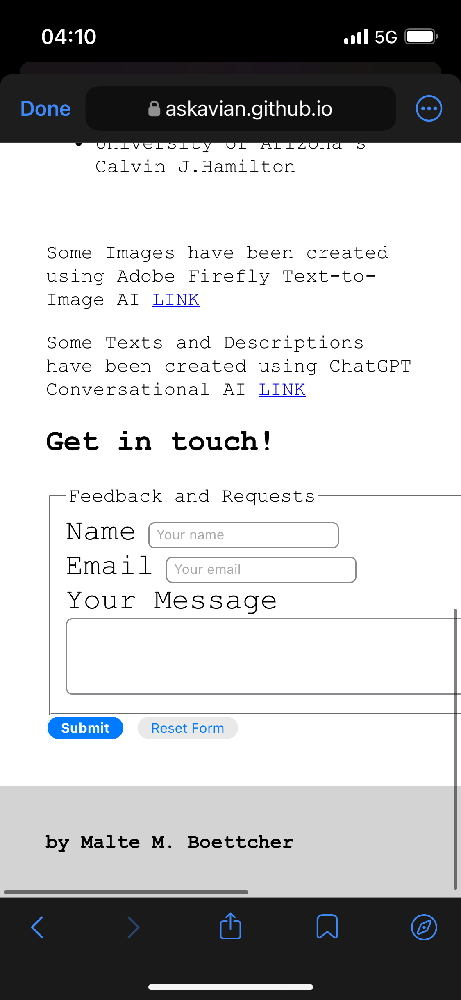

# **stars**

[Click here to go to the Live Project](https://askavian.github.io/stars/)

## **PLEASE NOTE**
For the first Deployments I did not added any Comments. Please Excuse this. After talking to my Mentor, I realized that I made an error and we decided that I would clarify the mistake by informing about it in the readme and NOT retroactively fixing or hiding it. 

Welcome to stars!

## **Planning**

### **Site Owner Goals**

- As a site owner, I want to provide a comprehensive view on space exploration prospects within our near future.
- As a site owner, I want to to present visual stunning images and media.

### **User Stories**

- As a site visitor, I want to learn and be axcited about space exploration.
- As a site visitor, I want to browse the website on as many devices as possible.
- As a visual-impaired site visitor, I want the site to be as accessible as possible. 

## **Features**

stars is a webpage that gives the user an easy-to-understand broad overview about the prospects of near-future space exploration. It outlines a way in wich humanity becomes a multi-planet species. 

Every page has its own **SEO** meta tag description and keywords.

#### **Used Technologies**  

- **HTML:** Hyper Text Markup Language
- **CSS:** Cascading Style Sheets

#### Adaptive Layout

The layout is fully responsive by using mostly %-Values or "vh" and "vw" settings. The Layout is easy-to-understand and clutter free. 

#### **Header and Navigation**  
The header includes a full cover image only interrupted by the Titel and Statement, filling out the entire screen. It dissapears by scrolling down and gives way to the Article Content. 

The Header cover image achieves the intended visual by giving a "height: 100vhmax" and locking it in place by "background-attachment: fixed;"

The nav-element is transparent, but pops-out by using contrasting colors and giving a white background when hovering over it. 

All Header Text (Nav, H1 and p) cast a Text Shadow of  #C70039. This is to achieve maximum readibility. The Text Color itself changes based on the background. It is either #000 or #fff

#### **Index**  
The Index Section sets the tone for space exploration and gives an overview. It is meant to be an introduction and jump-point for the content pages.

#### **Article**  
Each Article/Contant Page covers one celestial body in our Solra-System that might be a good fit for colonization. 

I created a template and repeated it for all other pages in the same format. 

The Layout follows the same rule. 
1. A cover photo and title to set the tone. 
2. A table containing the most important information on the object.
3. A profile picture (this does not scale well and will be fixed in a later version)
4. A general Text Overview.
5. An AI generated Image of a possible colony on said object.
6. A Text "Imagining a Colony"
    >This section is broken down in "Environmental Challenges", "Possible Design", "Functionality and Purpose" and "Economic Prospects"
7. A Gallery section leaving visitors with stunning images of the object.
    
    >NOTE:All Images can be maximised by clicking on it. They open in a new tap. In a later version, I want this to hover using JavaScript. This was not possible with css. 

    >IMPORTANT: On the Titan Page "titan.html" I also include two audio snippets from Titan. I would like to add this to all sites, but audio snippets are rare to come by. 

**Tablet, Laptop, Desktop and Mobile Version**

There are some issues with scalling on Smartphone devices. Tablets and monitors up to 4k are scaling well however. 

#### **Accessibility Focused** 
All media (Images and Sounds) have assisting descriptions (alt attribute for Images on screen readers and Links to the original file for Audio). Aria Labels are given were needed.

## Fonts

I chose the Google <strong>font-family: 'Courier New', Courier, monospace;</strong> because the white background of the articels and the black typewriter font should mimic a 1960s Government Paper work. This should be a throwback to the Golden Age of Space Exploration and the Space Race by the USSR againt the USA. (Moon Landing, etc...)

"monospace" is the fallback language here. 

#### **Footer**  
The footer is kept very simple and only includes my name. I will enhance it in the future with links to Social Media. 

## Testing

### Manual Testing  
- All testing is done manually on an iPhone 13, Windows PC (Chrome and Edge Browser) in FullHD and 4k Resolution. 

### Validation and Issues

## CSS & HTML
CSS Validation is fine 

PLEASE NOTE: HTML Validation has been done in accordance with guidlines, but showed two minor errors on the Article Pages.
I was NOT able to pinpoint the errors and after a long search, I have come to the conclusion that both elements (div and section)are rightfully CLOSED.

## Lighthouse

Lighthouse Validation is generally great, but gives minor feedback regarding the sizinbg ov Nav Buttons (too small).  

## Known Bugs and Flaws

The following Bugs remain open:

1. The Gallery Images doe not scale correctly when viewed on a very small viewport (Smartphone)

2. Some Cover Images do not load correctly on Smartphones

3. Some Cover Images are too big to be scaled meaningfully on very small viewports (Smartphones)

4. Standard iOS Mobile Buttons look out of place in this design

## **Development**

I used VS Code to do all the work. 

## **Deployment**

I followed Code Institue's Instructions and Deployed directly in github. 

## Version Control
I use Git for Version Control and GitHub for storage. 

**Sources and Code Snippets and Support**
- CSS Debugging Help by Uncle Phil (He is my neighbor and the guy I play Warhammer with)

- nav element inspiration from the "Debugging HTML & CSS In The Browser" Lesson of Code Institute

**Future Plans**

1. Include additional Media (Video for each pagen) and Background Audio for the front page (Cosmic Background radiation)
2. Rework credits given
3. Additional Pages
4. Include Aside Elements with Quotes from Scientists and Futurerists
5. Text Links to outside sources and articles
6. Better Responsive Design for Profile Picture and Table
7. Bigger Nav Icons on Mobile

---

Malte M. Boettcher
malte.boettcher@live.com

