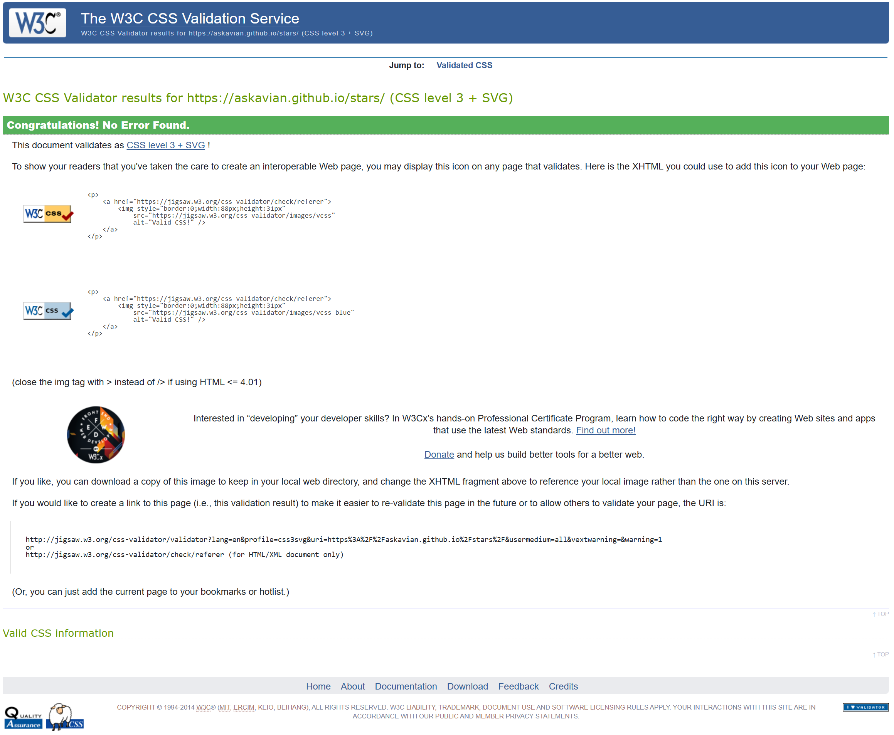

## **PLEASE NOTE**

1. This is a revised version after feedback. 

**Points to be revised and improved from Feedback**

To meet the **PASS** standards, there where two criteria not met from the first submit: 

2.2	    Fails to pass through the official (W3C) validator.

2.6     Doesn’t work well across various devices / screen sizes.

4.1	    Missing details in deployment section. **FIXED**

2. For the first Deployments I did not added any Comments. Please Excuse this. After talking to my Mentor, I realized that I made an error and we decided that I would clarify the mistake by informing about it in the readme and NOT retroactively fixing or hiding it. REVISED AFTER FEEDBACK

# **Welcome to stars**

[Click here to go to the Live Project](https://askavian.github.io/stars/)

## **Table of contents**

- [**Welcome to stars**](#warhammer-40.000-quiz)
  - [**Table of contents**](#table-of-contents)
  - [**Planning**](#planning)
    - [**Site Owner Goals**](#site-owner-goals)
    - [**User Stories**](#user-stories)
  - [**Features**](#features)
    - [**Used Technologies**](#used-technologies)
    - [**Design**](#design)
  - [**Testing**](#testing)
    - [**Manual Testing**](#manual-testing)
    - [**Validation and Issues**](#validation-and-issues)
      - [**HTML**](#html)
      - [**CSS**](#css)
      - [**Lighthouse**](#lighthouse)
    - [**Bugs**](#bugs)
  - [**Deployment**](#deployment)
  - [**Version Control**](#version-control)
  - [**Development Process and Commands**](#development-process-and-commands)
  - [**Clone and Fork the Repository**](#clone-and-fork-the-repository)
    - [**Clone the Repository**](#clone-the-repository)
    - [**Fork the Repository**](#fork-the-repository)
  - [**Future Enhancements**](#future-enhancements)
  - [**Credits**](#credits)
  - [**Finished Product**](#finished-product)

## **Planning**

### **Site Owner Goals**

- As a site owner, I want to provide a comprehensive view on space exploration prospects within our near future.
- As a site owner, I want to to present visual stunning images and media.

### **User Stories**

- As a site visitor, I want to learn and be axcited about space exploration.
- As a site visitor, I want to browse the website on as many devices as possible.
- As a visual-impaired site visitor, I want the site to be as accessible as possible.

## **Features**

- stars is a webpage that gives the user an easy-to-understand but broad overview about the prospects of near-future space exploration. It outlines a way in wich humanity becomes a multi-planet species.
- Every page has its own SEO meta tag description and keywords. 
- Each page features either visual or visual and audio elements to bring convey information on the topic and to set the tone.  

#### **Used Technologies**

- **HTML:** Hyper Text Markup Language
- **CSS:** Cascading Style Sheets

#### Design

The Index Section sets the tone for space exploration and gives an overview. It is meant to be an introduction and jump-point for the content pages.

**Header and Navigation**

The header includes a full cover image only interrupted by the Titel and Statement, filling out the entire screen. It dissapears by scrolling down and gives way to the Article Content.

The Header cover image achieves the intended visual by giving a "height: 100vhmax" and locking it in place by "background-attachment: fixed;"

The nav-element is transparent, but pops-out by using contrasting colors and giving a white background when hovering over it.

All Header Text (Nav, H1 and p) cast a Text Shadow of #C70039. This is to achieve maximum readibility. The Text Color itself changes based on the background. It is either #000 or #fff

**Adaptive Layout**

The layout is fully responsive by using mostly %-Values or "vh" and "vw" settings. The Layout is easy-to-understand and clutter free.

**Article**  

Each Article/Contant Page covers one celestial body in our Solra-System that might be a good fit for colonization. 

I created a template and repeated it for all other pages in the same format. 

The Layout follows the same rule. 
1. A cover photo and title to set the tone. 
2. A table containing the most important information on the object.
3. A profile picture (this does not scale well and will be fixed in a later version)
4. A general Text Overview.
5. An AI generated Image of a possible colony on said object.
6. A Text "Imagining a Colony"
    >This section is broken down in "Environmental Challenges", "Possible Design", "Functionality and Purpose" and "Economic Prospects"
7. A Gallery section leaving visitors with stunning images of the object.
    
    **PLEASE NOTE** All Images can be maximised by clicking on it. They open in a new tap. In a later version, I want this to hover using JavaScript. This was not possible with css. 

    **IMPORTANT** On the Titan Page "titan.html" I also include two audio snippets from Titan. I would like to add this to all sites, but audio snippets are rare to come by. 

**Tablet, Laptop, Desktop and Mobile Version**

There are some issues with scalling on Smartphone devices. Tablets and monitors up to 4k are scaling well however. 

#### **Accessibility Focused** 

All media (Images and Sounds) have assisting descriptions (alt attribute for Images on screen readers and Links to the original file for Audio). Aria Labels are given were needed.

**Typeface** 

I chose the Google font-family: **'Courier New', Courier, monospace;** because the white background of the articels and the black typewriter font should mimic a 1960s Government Paper work. This should be a throwback to the Golden Age of Space Exploration and the Space Race by the USSR againt the USA. (Moon Landing, etc...)

**"monospace"** is the fallback language here.

## Testing

### Manual Testing
- Manual testing was used during the entire development proccess. 
- Testing was done on multiple Devices and Viewports 
    - 4k Monitor
    - 1080p Monitor
    - IPad Air 4.Gen
    - iPhone 13
- Build in Developer Tools in Microsoft Edge and Google Chrome where used for debugging

### Validation and Issues

#### HTML

#### index.html

HTML was validated using the W3C Markup Validation Service 

**Result: XXXTBDXXX**

XXXNEED REVISIONXXX

#### CSS  

CSS was validated using the W3C CSS Validation Service.

**Result: No errors found.**

#### Lighthouse

Lighthouse Validation is generally great, but gives minor feedback regarding the sizing of Nav Buttons (too small).  

**PLEASE NOTE** By actual testing the page on mobile devices and letting other people including people with thicc fingers and older people use it, I came to the conclusion that the size of the buttons is appropriate. 

**Result: No errors found.**

**Result: No errors found.**

However, the validation returned 29 Warnings in regards to either ES6 Version or the Mozilla Browser. 

## Bugs

XXX NEEDS REVISION XXX

The following Bugs remain open:

1. The Gallery Images doe not scale correctly when viewed on a very small viewport (Smartphone)

2. Some Cover Images do not load correctly on Smartphones

3. Some Cover Images are too big to be scaled meaningfully on very small viewports (Smartphones)

4. Standard iOS Mobile Buttons look out of place in this design

## **Deployment**

Code Institutes Guidlines for deployments are used and recommended:

1. Open the [repository](https://github.com/askavian/stars) and go to the **Settings** tab.
2. Navigate to the **Pages** tab in the left menu.
3. Choose **Deploy from a main** and select the according branch, *main* in my case.
4. Click save. The link to the deployed website can then be found in the [repository](https://github.com/askavian/stars) on the right menu under **Environments**.

The link to my live site is: [Warhammer Quiz](https://askavian.github.io/stars/)

## Version Control
* [GitHub](https://github.com/) is used for Version Control.
* There is only a single branch **main** used.

## Development Process and Commands

- Using the template provide by Code Institute as basis [gitpod template](https://github.com/Code-Institute-Org/gitpod-full-template).  
- I used VSCode and via GitPod and tried to maintain **meningfull** and regular commits (i.e. features, bugs fixes, etc...). 
    **PLEASE NOTE** As stated in the disclaimer on the top, I did not added commit comments in the beginning. Please excuse that. This is due to me being a newbie.  
- Each Git Commit deployes after a short delay directly als to GitHub Pages.

## Clone and Fork the Repository

You can easily clone or fork the **stars** repository to make changes or use it as a reference. Follow the steps below based on your operating system:

#### **Fork the Repository**

1. Visit the repository on GitHub: [Warhammer Quiz](https://github.com/askavian/stars).  
2. Click the **Fork** button in the top-right corner to create your own copy of the repository under your GitHub account.

#### **Clone the Repository**

The repository has a single branch, with code committed sequentially for clarity. It can be forked or cloned for further development.

## Future Enhancements

To further improve the typing game, I would add the following features:

- **More Content:** 
    - Include additional Media (Video for each pagen) and Background Audio for the front page (Cosmic Background radiation)
    - Additional Pages for more settlement prospects. 
- **Credits:** 
    - Rework the credits section and provide credits to artists and scientists directly under the respective image. 
    - Text Links to outside sources and articles
- **Page Format** 
    - Include Aside Elements top better structure the articles and the core information. Similar to a news article. 
- **Navigation** 
    - Bigger Nav Icons on MobileInclude images to the questions.
- **Design** 
    - Better Responsive Design for Profile Picture and Table.
    - Include a Favicon
    - Include JavaScript to fullscreen an image by hovering over it and not opening int in a _blank tab

## Credits

- My Neighbor for CSS Help.
- Code Institute Students and Alumnis for JavaScript support. 
- European Space Agency's (esa) Multimedia Library: LINK
- Jet Propulsion Laboratory (JPL) Photojournal: LINK
- European Southern Observatory (ESO): LINK
- NSSDCA Photo Gallery (NASA): LINK
- Space Center Houston: LINK
- Johns Hopkins University Applied Physics Laboratory: LINK
- Kevin Gill
- University of Arizona's Calvin J.Hamilton

## Finished Product

Thank you for reading this. I hope you enjoy my work!

Author: [Malte M. Boettcher](https://github.com/askavian/)
